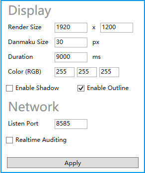
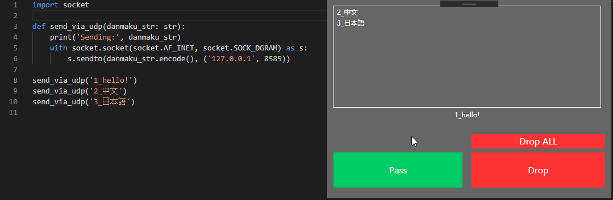

# Feature
### Settings for danmaku style, network, and auditing.


### Realtime auditing


# Download
You can download compiled binary file from [Releases](https://github.com/StoneMoe/OhMyDanmaku/releases)

# Build from source
### Clone
```
git clone https://github.com/StoneMoe/OhMyDanmaku.git
cd OhMyDanmaku
git submodule init
git submodule update
```

### Build
Use Visual Studio

### How to Send Danmaku
OhMyDanmaku listen on `localhost:8585` with `UDP` by default.

Send string data in **UTF-8** to listener, then a danmaku will across screen like a bullet

Also, you can use reverse proxy to handle the communication, there is a sample in folder `web`

# License
### GPL v2
